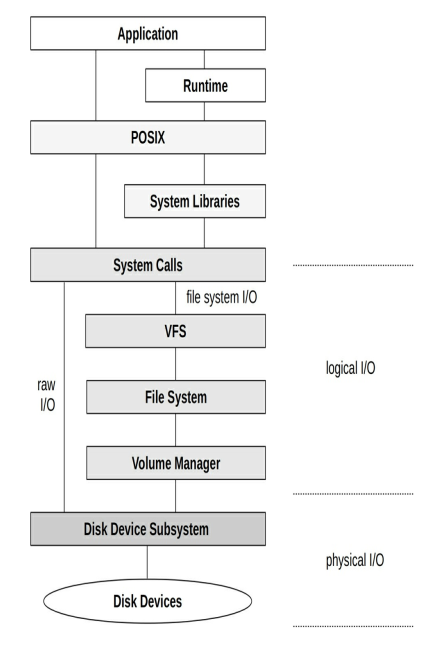
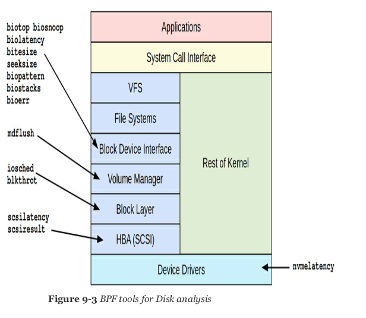
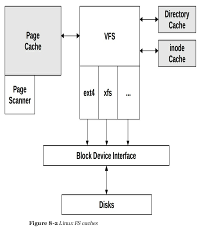

## where to hook

one of the problems I need to solve with ebpf is that I need to decide were to hook the instrumentation. This influences the performance gain that I can potentially obtain from the thesis
[programmable ssd in datacenter](https://cacm.acm.org/magazines/2019/6/237002-programmable-solid-state-storage-in-future-cloud-datacenters/fulltext?mobile=false)


ebpf is powerful and can be used to hook at many different anchor points. Let's suppose we have the following scenario

```

																						______________
CLIENT -------------------------------------|	DATACENTER |-------SSD
		     					1GB/s link				    		|			 			 |-------SSD
       -------------------------------------|____________|-------SSD
		      RTT 10ms

```

if we want to make operations on 10GB of data, in the current scenario we need to:
- retrieve it from the SSD
- process throught the datacenter software stack (kernel space to user space)
- transfer across the network
- process through user software stack (kernel space to user space)

A back of the envelope estimate of the latency is

1RTT for request + 1RTT for data transfer + network transfer time (size/bw = 10s) + 2 x processing time + storage transfer time

### hook placement
clearly, the major component for latency reduction is eliminating the network transfer time.
For this reason, the user will be given an api on client side, but the bpf extension will hook a function in the datacenter stack.

this leaves us with the latency:
- DC processing time + storage transfer time

Assuming that we do not have the possibility to actually push functionality inside the storage itself, the goal is to optimize the processing time. An operation on data will trigger a read call from userspace. Underneath, the kernel translates this in a file-system relevant operation through the VFS, and actually perform the I/O request via the block device interface.



The read will obtain the result in a user-space buffer. However, while the request is being served, a kernel buffer is being used. In order to maximize performance gains, it's preferable to anchor the bpf hook to the kernel-level buffer.

A good direction to follow would be the biosnoop tool by brendan gregg. At this level, it is still possible to trace block IO with a link to the PID that issued the request. The two anchor points for my functionality would be either read -> follow opensnoop or block I/O -> follow biosnoop




An alternative implementation in the scenario we're looking at is the sendfile call. If we can hook the copy between kernel buffers from the I/O buffer to the socket buffer, only returning the result, that would be great. But this is only valid if data needs to be returned to the client side. If the computation is server-side manipulation of data, then this is not applicable.

[zero-copy](https://www.linuxjournal.com/article/6345)

```
blk_account_io_completion(struct request *req, unsigned int bytes) //https://elixir.bootlin.com/linux/v4.9/source/block/blk-core.c#L2235

bool blk_update_request(struct request *req, int error, unsigned int nr_bytes)

```

## considerations
- I can identify the PID but what if the same PID issues multiple requests? I need to instrument based on the file that is accessed, so I need to investigate if requests are batched or if I can assume that a request corresponds to a single file transfer.
- instrumenting at the read() level makes this easier to achieve, but we are not able to avoid the copy from kernel to user buffer
- the read() syscall is probably less subject to future changes than the kernel level interfaces with disk (verify how it was in the past though), so this might make the bpf hooks less future-proof if something changes in the block device interface (and the survey suggests that there is research happening in that direction). so the question is, what is the sweet spot between a STABLE anchor point and an EFFICIENT one?
- How to deal with potentially cached data? Should I assume that the data is always on disk and that an IO request will be issued? Because if data is in the file system cache, that's not the case and I will miss out on some data if I instrument on the block IO level, while I'd be able to catch it in a read() instrumentation -> (check vfsstat)
- the gain for the blocl IO is actually relevant only if I can avoid copying the data to userland, so it should affect the buffer size being copied, or consume the buffer in kernel memory and return results on a bpf map -> is that even possible?



